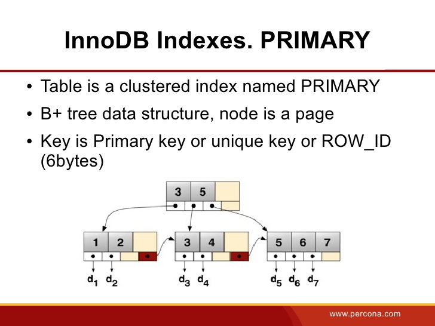
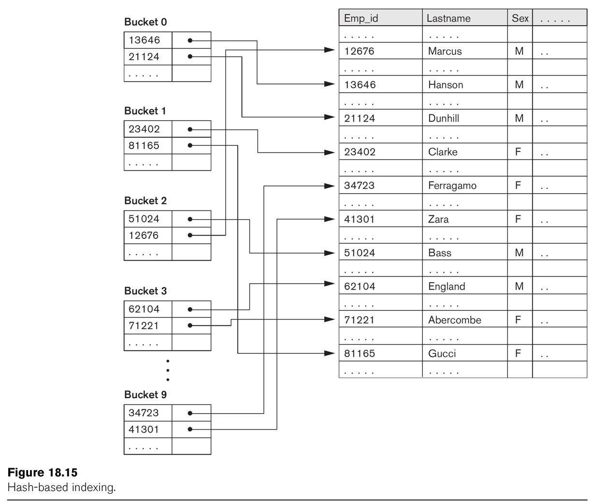

# Opdracht 5

1)

Twee mogelijke indexeringsmethoden zijn `B-Tree` en `Hash Indexes`:

`B-Tree` kan worden gebruikt om kolommen te vergelijken in queries gebruikmakend van vergelijkingsoperators (`=`, `>`, `<`, `>=` enzovoort).

Voorbeelden:

```sql
SELECT * FROM table WHERE name LIKE 'Patrick%';
SELECT * FROM table WHERE name LIKE 'Pat%_ck%';
```



`Hash Indexes` worden minder gebruikt, maar zijn wel sneller. Ze worden niet gebruikt bij vergelijkingsoperators, maar wel bij `=` of `<=>`. Het zijn dus, zoals deze ook bij `Objective-C` en `Swift` gebruikt worden, zogenaamde `key-value stores`. Dictionaries dus.



2)

- [x] Je hebt in ieder geval één tabel nodig waarin je zowel `B-Tree` als `Hash Indexes`-gebaseerde queries uit kunt voeren.
- [x] Zoals hierboven een aantal voorbeeldqueries worden gegeven, zijn deze uiteraard vereist om de verschillende indexeringsmethoden te testen.
- [x] Het aangeven van de verschillen in de metingen, zoals in een tabel.

3)

```sql
CREATE TABLE Persons
(
  id int NOT NULL AUTO_INCREMENT,
  lastName varchar(255) NOT NULL,
  firstName varchar(255),
  address varchar(255),
  city varchar(255),
  PRIMARY KEY (id)
);

CALL data_generator_2('dbo6', 'Persons', 10000, 0)
```

4)

`B-Tree`:

```sql
SELECT * FROM Persons WHERE firstName LIKE 'P%';
```

```sql
SELECT * FROM Persons WHERE lastName LIKE 'P%_%';
```

`Hash Indexes`:

```sql
SELECT * FROM Persons WHERE id BETWEEN 10 AND 2000;
```

5)

| Methode      | Query                                               | Tijd             |
|--------------|-----------------------------------------------------|------------------|
| B-Tree       | SELECT * FROM Persons WHERE firstName LIKE 'P%';    | 1.1 (consistent) |
| B-Tree       | SELECT * FROM Persons WHERE lastName LIKE 'P%_%';   | 1.5 (consistent) |
| Hash Indexes | SELECT * FROM Persons WHERE id BETWEEN 10 AND 2000; | 2.9, daarna 0.9  |

6)

Maak, als dat kan, gebruik van Hash Indexes. Let wel op de limieten ervan (enkel Primary Key querying). Dit is sneller dan met een `B-Tree` (`O(1)` vs `O(n)`).

`B-Tree` is over het algemeen echter toch makkelijker, ook om te onderhouden en te scalen.

Zoals in 1) te zien is, werken `Hash Indexes` met zogenaamde "buckets" waar de objecten in worden opgeslagen. Alleen binnen deze buckets wordt gezocht bij het uitvoeren van zo'n query.